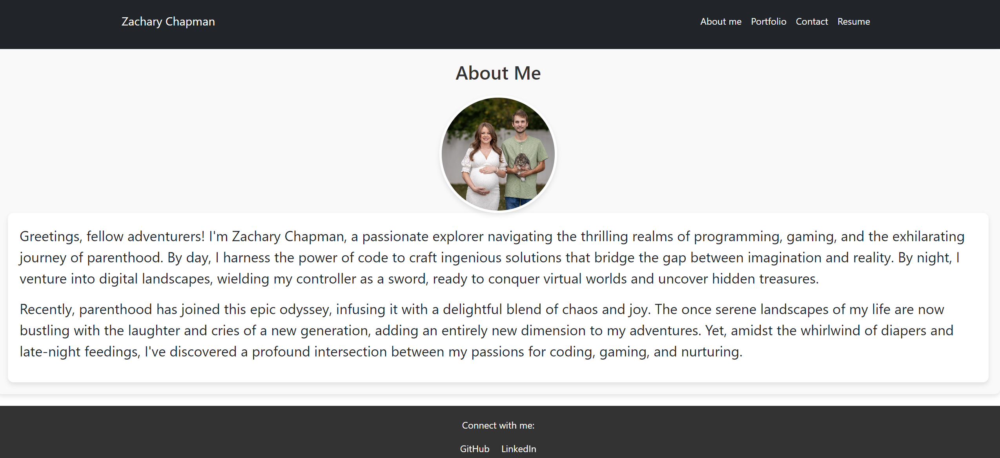

# My React Portfolio

Welcome to my React portfolio! This project showcases my skills, projects, and experiences.

## Table of Contents
- [About](#about)
- [Features](#features)
- [Technologies Used](#technologies-used)
- [Getting Started](#getting-started)
- [Usage](#usage)
- [Contributing](#contributing)
- [License](#license)

[Visit Website](https://main--react-chapman.netlify.app/)

## About
This portfolio is designed to provide an overview of my work, skills, and experiences as a developer. It includes sections for projects, skills, education, and contact information.

## Features
- Display projects with details such as name, description, technologies used, and links to live/demo and GitHub repositories.
- Showcase skills and expertise.
- Provide information about education, certifications, and relevant experiences.
- Contact form for visitors to get in touch.

## Technologies Used
- React
- HTML/CSS
- JavaScript

## Getting Started
To get a local copy up and running, follow these steps:

1. Clone the repository: `git clone https://github.com/your-username/react-portfolio.git`
2. Navigate to the project directory: `cd react-portfolio`
3. Install dependencies: `npm install`
4. Start the development server: `npm start`

## Usage
- Modify the `src/data/projects.js` file to add your projects.
- Customize the content of the portfolio by editing the components in the `src/components` directory.
- Update the `public/favicon.ico` and `public/logo192.png` files with your own logo/favicon.
- Customize styles by modifying the CSS files in the `src/styles` directory.
- Add your own images, icons, and additional pages as needed.

## Contributing
Contributions are welcome! If you'd like to contribute to this project, please follow these steps:

1. Fork the repository.
2. Create a new branch (`git checkout -b feature/your-feature-name`).
3. Make your changes.
4. Commit your changes (`git commit -m 'Add some feature'`).
5. Push to the branch (`git push origin feature/your-feature-name`).
6. Open a pull request.

## License
This project is licensed under the [MIT License](LICENSE).
